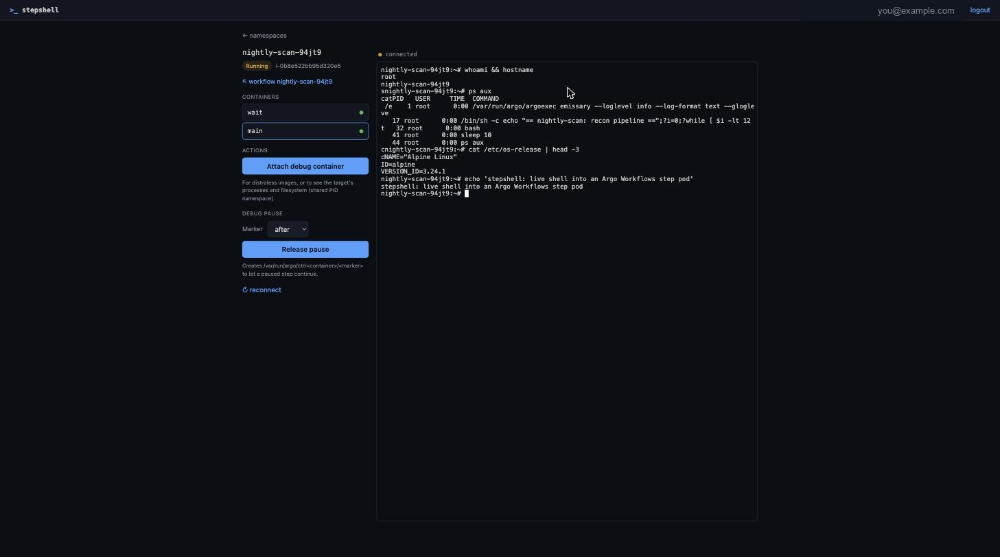
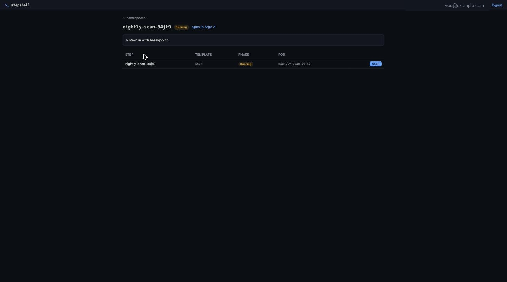

<h1 align="center">stepshell</h1>

<p align="center">
  <b>A shell into your Kubernetes pods that your cluster's RBAC actually
  authorizes — and that finally understands Argo Workflows.</b>
</p>

<p align="center">
  <a href="https://github.com/aortmann/stepshell/blob/main/LICENSE"></a>
  
  
  
</p>

<p align="center">
  
</p>

Open a terminal into any running pod straight from the Argo Workflows (or Argo
CD) UI. See the processes, `tail -f` the logs, poke at the filesystem — as
**you**, not as a shared service account. And when a step is too fast to catch,
**re-run it with a breakpoint** so it holds still while you look inside.

## Why this exists

If you run Argo Workflows, you've hit this: a step fails, you want to look
inside the pod, and there's *no terminal in the UI*. So you race `kubectl exec`
against a pod that's already been garbage-collected.

- **The UI has no terminal** — and no extension point to add one.
  [argoproj/argo-workflows#6945](https://github.com/argoproj/argo-workflows/issues/6945)
  has been open since 2021. The maintainers' answer to "let me shell in" is
  literally *"use `kubectl exec`."*
- **The debug-pause backend exists but never got a UI.**
  [#6841](https://github.com/argoproj/argo-workflows/issues/6841) shipped the
  mechanism (two env vars + a marker file) and closed. Nobody built the button.
- **Generic K8s web terminals don't fit.** They either ship with *no auth* (a
  root shell for anyone who reaches the URL) or they're a whole platform you now
  have to operate.

stepshell is the small, authenticated, Argo-aware piece that was missing — one
Go binary and a Helm chart.

## Features

| | |
|---|---|
| 🔐 **Real per-user identity** | OIDC login, then Kubernetes **impersonation**. The server holds *no* `pods/exec` rights of its own — your cluster's RBAC decides, and the API-server audit log sees the actual person, not a shared SA. |
| 🧩 **Argo Workflows native** | Browse workflows, jump to a step's pod, and **re-run with a breakpoint** — one click injects `ARGO_DEBUG_PAUSE_*`, holds the step, and hands you a shell. Release it from the UI when you're done. |
| 🐚 **Shell-less images** | Distroless pod with no `/bin/sh`? One click attaches an ephemeral debug container sharing the target's PID namespace and mounts — you get its processes (`/proc/1/root`) and filesystem anyway. |
| 🔗 **Deep-linkable** | `/shell/{ns}/{pod}?container=main`, or `?cmd=tail -f /var/log/app.log`. Drop it straight into the Argo UI as a per-pod link. |
| 📦 **Standalone** | Single Go binary with the UI embedded. No database — the session is an encrypted cookie. Bundled Dex can front GitHub SSO, or point it at your own IdP. |

<p align="center">
  
</p>

> **Pausing is optional.** A live pod is always shell-able without pausing — the
> breakpoint is only for the step that finishes before you can catch it.

## Architecture

```
browser ──HTTPS──► stepshell ──impersonated REST/WebSocket──► kube-apiserver
 xterm.js           OIDC + AES-GCM cookie                      RBAC decides
                    exec bridge (client-go remotecommand)      audit sees the user
```

No database. The session is an encrypted cookie, so replicas only share the
session key. See [`docs/spec.md`](docs/spec.md) for the full design, threat
model and HTTP API.

## Quick start (local, no auth)

```bash
make ui           # build the embedded UI once
make run          # serves on http://localhost:8080 as $USER@local against your kube-context
```

`--auth.mode=none` is refused on any non-localhost URL unless you also pass
`--auth.allow-insecure-none`. Don't.

## Deploy

```bash
helm install stepshell ./charts/stepshell \
  --set baseURL=https://stepshell.example.com \
  --set oidc.issuer=https://dex.example.com \
  --set oidc.clientID=stepshell \
  --set oidc.clientSecret=<secret> \
  --set argo.uiURL=https://argo-workflows.example.com \
  --set ingress.enabled=true \
  --set-json 'rbac.allowedGroups=["your-oidc-group"]'
```

The server ServiceAccount gets only `impersonate` on users/groups. Grant your
users the namespaced access they need yourself, or let the chart do it:

```yaml
userAccess:
  enabled: true
  namespaces: [default, csa]
  subjects:
    - kind: Group
      name: your-oidc-group
```

### GitHub login via the bundled Dex

GitHub is not an OIDC provider, so stepshell can bring its own
[Dex](https://dexidp.io) to bridge it — self-contained, no dependency on any
other service. The `groups` claim arrives as `org:team` (e.g.
`your-org:platform`), which you pin in `rbac.allowedGroups` and can reuse in
your cluster RBAC.

1. Create a **GitHub OAuth app** (Settings → Developer settings → OAuth Apps)
   with callback URL `https://stepshell.example.com/dex/callback`.

2. Enable the bundled Dex. stepshell's `oidc.*` fields are wired to it
   automatically — you only pass the GitHub app credentials:

   ```bash
   helm install stepshell ./charts/stepshell \
     --set baseURL=https://stepshell.example.com \
     --set dex.enabled=true \
     --set dex.publicURL=https://stepshell.example.com/dex \
     --set dex.github.clientID=<oauth app id> \
     --set dex.github.clientSecret=<oauth app secret> \
     --set-json 'dex.github.orgs=[{"name":"your-org","teams":["cloud","admins"]}]' \
     --set ingress.enabled=true \
     --set-json 'rbac.allowedGroups=["your-org:cloud","your-org:admins"]'
   ```

   Dex is served under `/dex` on the same host and ingress; the chart routes it
   automatically. The stepshell↔Dex client secret is generated and kept stable
   across upgrades.

Prefer an existing IdP (Okta, Entra, Google, or a Dex you already run)? Leave
`dex.enabled=false` and set `oidc.issuer` / `oidc.clientID` / `oidc.clientSecret`
directly. The issuer must match the provider's advertised `issuer` exactly.

**Behind an AWS ALB**, raise the idle timeout so long-lived exec WebSockets
don't drop at 60s:

```yaml
ingress:
  annotations:
    alb.ingress.kubernetes.io/load-balancer-attributes: idle_timeout.timeout_seconds=3600
```

## Wire it into the Argo UIs

Argo Workflows (`controller.links`):

```yaml
- name: Shell
  scope: pod
  target: _blank
  url: https://stepshell.example.com/shell/${metadata.namespace}/${metadata.name}?container=main
- name: Debug workflow
  scope: workflow
  target: _blank
  url: https://stepshell.example.com/wf/${metadata.namespace}/${metadata.name}
```

Argo CD (`argocd-cm`):

```yaml
resource.links: |
  - url: https://stepshell.example.com/shell/{{.resource.metadata.namespace}}/{{.resource.metadata.name}}
    title: Shell
    icon.class: fa-terminal
    if: resource.kind == "Pod"
```

## Debug pause, end to end

The feature Argo built but never surfaced — now a button:

1. On a workflow page, open **Re-run with breakpoint**, choose *pause after
   step* (and optionally which templates), submit. stepshell clones the
   workflow with `ARGO_DEBUG_PAUSE_AFTER=true` injected and `podGC` set to
   `OnWorkflowCompletion` so the paused pod survives.
2. When the step reaches the breakpoint the pod stays **Running**. Open its
   **Shell**, inspect processes/filesystem/volumes.
3. Hit **Release pause** (or `touch /var/run/argo/ctr/main/after` yourself) and
   the step continues. Outputs are saved after release.

## Security

- Impersonation means a server compromise lets an attacker impersonate any user
  the `impersonate` rule allows — pin `rbac.allowedGroups`, run the distroless
  read-only image, add a NetworkPolicy.
- Inside a pod you have whatever the pod's ServiceAccount allows, exactly like
  `kubectl exec`. Set `automountServiceAccountToken: false` on pods that don't
  need the API.
- Sessions are AES-256-GCM cookies (`HttpOnly; Secure; SameSite=Lax`), bounded
  by `session.ttl`. Mutating requests require the `X-Stepshell` header; the
  WebSocket handshake checks `Origin`.

## Development

```bash
make test     # go test + tsc --noEmit
make lint     # go vet + gofmt -l
cd web && npm run watch   # rebuild UI on change
```

## License

Apache-2.0.
